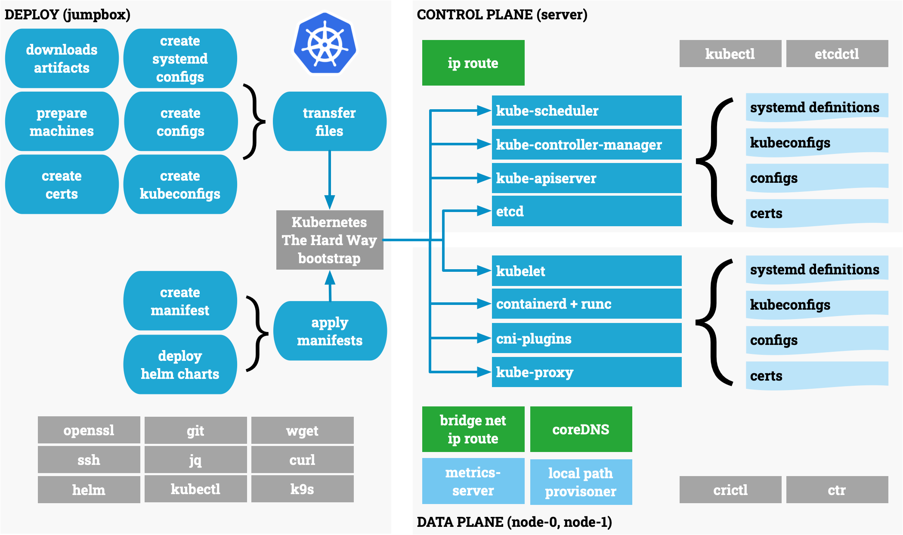

# Kubernetes The Hard Way - simplified

Kubernetes The Hard Way - Learn how to build K8s from scratch, the way tradition started by Kelsey Hightower!

At 2015, Kelsey Hightower published his legendary __Kubernetes the Hard Way__ tutorial — a hands-on deep dive into building Kubernetes from the ground up. It became a foundational learning experience for thousands of cloud-native practitioners.

I had the privilege of attending one of Kelsey’s very first workshops at DockerCon San Francisco 2015, and that experience left a lasting impact.
So first: Thank you, Kelsey, for your generosity, clarity, and passion for teaching!

This course is my humble tribute: a simplified and interactive version of Kubernetes the Hard Way hosted on iximiuz labs.
It’s designed to illustrate key concepts more clearly and make the journey more accessible and quicker to start — especially for those who want to explore the internals without fighting infrastructure setup.

Whether you’re a DevOps engineer, platform builder, or just curious about how Kubernetes really works under the hood — this course is for you.



At KubeCon 2025 in London, I had the joy of watching Kubernetes the Hard Way brought to life by Sandeep Kanabar and Lucy Sweet
— two amazing engineers who made the journey both clear and inspiring. 
Their session reignited my passion for hands-on learning and reminded me why this path matters.
That experience inspired me to reimagine it for iximiuz labs — making Kubernetes internals easier to explore,
quicker to start, and just as powerful to learn. This talk is about that journey — and 
how we can keep learning the hard way, made a little easier.

- [Cloud Native University Hosted by CNCF](https://colocatedeventseu2025.sched.com/overview/type/Cloud+Native+University)
- [Kubernetes the Hard Way: A Live Journey - Sandeep Kanabar, Gen (formerly NortonLifeLock) & Lucy Sweet, Uber](https://colocatedeventseu2025.sched.com/event/1u5ga/kubernetes-the-hard-way-a-live-journey-sandeep-kanabar-gen-formerly-nortonlifelock-lucy-sweet-uber)

## Usage

- Connect to iximiuz labs with Google Chrome or Firefox
  - [Kubernetes The Hard Way - Learn how to build K8s from scratch! by Peter Rossbach](https://labs.iximiuz.com/courses/kubernetes-the-hard-way-simplified-09885dc6)
    - Follow the instructions in the lab content.
- Review the provided scripts to set up your flexbox playground 

Navigate to jumpbox terminal and accessible

```shell
git clone https://github.com/bee-infraverse/kubernetes-the-hard-way-simplified.git
cd ~/kubernetes-the-hard-way-simplified/bootstrap
# check env.sh and overwrite versions
./bootstrap.sh
source ~/.bashrc
# Install add ons
# coredns, metrics-server, local-path-provisioner
./addons.sh

# check
k get nodes
k get pods -A
k get sc
k top nodes
k top pods -A
```

## Other cool Kubernetes The Hard Way resources

- [Kubernetes The Hard Way - Learn how to build K8s from scratch! by Peter Rossbach](https://labs.iximiuz.com/courses/kubernetes-the-hard-way-simplified-09885dc6)
- [Kubernetes the Hard Way Playground, by Márk Sági-Kazár](https://labs.iximiuz.com/playgrounds/kubernetes-the-hard-way-7df4f945/)
- [Kubernetes the Hard Way (GitHub) by Kelsey Hightower ](https://github.com/kelseyhightower/kubernetes-the-hard-way)
- [Home operations Github Projects](https://github.com/home-operations)
  - [Kubernetes Homelab Discord channel](https://discord.com/invite/homelab)
  - [onedr0p Kubernetes cluster-template](https://github.com/onedr0p/cluster-template)
- [iximiuz labs](https://labs.iximiuz.com)

## License

- [Apache 2 License](./LICENSE)

Great job, Kelsey, Sandeep and Lucy. I hope many more will follow the path you paved and continue the journey into the world of cloud native.

Regards,
`├─☺︎─┤` The Humble Sign Painter - Peter Rossbach